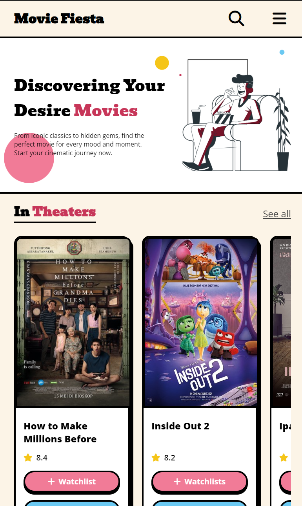

### Discovering Your Desire Movies

# Introduction

Hello from Cahya, here is my website for assigment module 1. First, you can visit my website at :

[Movie Fiesta](https://moviefiestaproject.netlify.app/)

**Movie Fiesta** is a web that contain alot information about movies. In this website you can see what films are on going in theaters, Top 10 Movies of the week and popular celebrities.

# Navigation
- **Home** : Navigate to home page.
- **Movies** : Navigate to list of movies.
- **TV Shows** : Navigate to list of tv shows.
- **Watchlists** : Navigate to your watchlist.
- **Sign Up** : You can create an account. You can go to **sign up form** by click the sign up button

# Main Content
Here are features on **Movie Fiesta** :

- **In Theaters** : In this section you can see movies that on screening in theaters. You can see the rating and add to your watchlist. And you can also see trailer of the movie.
- **Top 10 This Week**: In this section you can see top 10 popular movies based on views.
- **Most Popular Celebrities**: In this section you can see popular celebrities at the moment.

# Future Changes :

- [x] Style index.html with CSS.
- [x] Put more movie list to main content.
- [x] Make sign up form become modal when sign up link just clicked.
- [x] Deploy project to Netlify.

# There are Animations!!!

# Responsive Layout :

MovieFiesta website has applied responsive layout for different devices using @media-query with css. There are **3** __*break point*__, **Phone** (max-width: **843px**), **Tablet** (max-width: **1280px**) and **Desktop** (min-width: **1280px**).

| Phone     | Phone Header | 
| :---:       |    :----:   | 
|       |          | 

| Phone Search Menu | Tablet |
| :---:             | :--: |
|  |  |

| Desktop |
| :---: |
|  |

<h2 align="center" style="color:#6BC9F2;">Enjoy your movies</h2>

