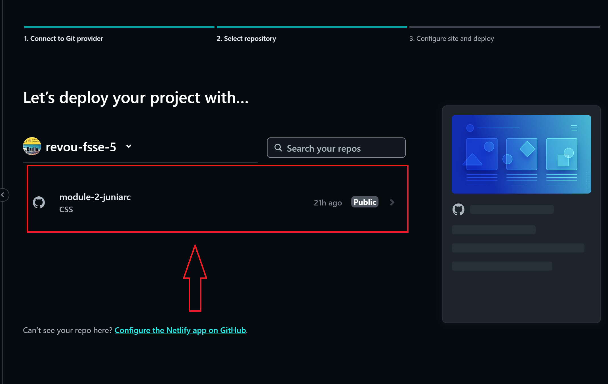
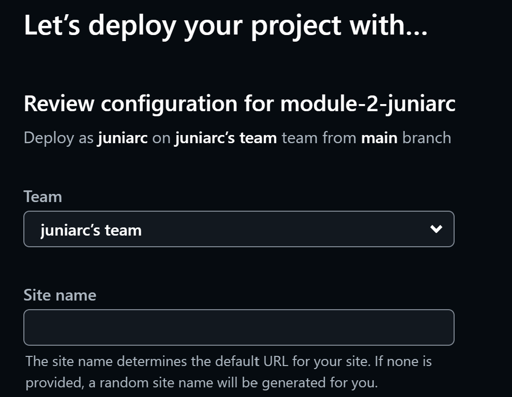

### Discovering Your Desire Movies

# Introduction

Hello from Cahya, here is my website for assigment module 1. First, you can visit my website at :

[Movie Fiesta](https://moviefiesta.site/)

**Movie Fiesta** is a web that contain alot information about movies. In this website you can see what films are on going in theaters, Top 10 Movies of the week and popular celebrities.

# Navigation
- **Home** : Navigate to home page.
- **Movies** : Navigate to list of movies.
- **TV Shows** : Navigate to list of tv shows.
- **Watchlists** : Navigate to your watchlist.
- **Sign Up** : You can create an account. You can go to **sign up form** by click the sign up button

# Main Content
Here are features on **Movie Fiesta** :

- **In Theaters** : In this section you can see movies that on screening in theaters. You can see the rating and add to your watchlist. And you can also see trailer of the movie.
- **Top 10 This Week**: In this section you can see top 10 popular movies based on views.
- **Most Popular Celebrities**: In this section you can see popular celebrities at the moment.

# There are Animations!!!

# Responsive Layout :

MovieFiesta website has applied responsive layout for different devices using @media-query with css. There are **3** __*break point*__, **Phone** (max-width: **843px**), **Tablet** (max-width: **1280px**) and **Desktop** (min-width: **1280px**).

| Phone     | Phone Header | 
| :---:       |    :----:   | 
|       |          | 

| Phone Search Menu | Tablet |
| :---:             | :--: |
|  |  |

| Desktop |
| :---: |
|  |

# New Feaetures!!

1. News Section with carousel images.

2. Discovering your desire movies.

3. New Footer style and you can change page's theme to dark-mode by click the button.

# How To Connect Github to Netlify
1. Register Netlify account or if you already have one, you can login. If you want to register you have to prepare your identity card (KTP).

2. On home page, click "Add new site" and then click "Import an existing project".

3. And connect to your Github profile. Make sure to set "Public" your repository that want you to deploy.

4. Click the repository that you want to deploy.

5. Fill site name and base directory (directory that contains index.html)

6. Wait untill deployment finish. After that you will have an url of your site. 

# Automation Deploy in Netlify
If you deploy your repository with Netlify, you don't have to worry about steps or configuration. As long as you **git push**  your commit at local repository to your remote (Github) repository , you will have an automation update.

# How To Connect Custome Domain and DSN
1. Register to Niagahoster, or if you already have an account you can login.

2. First , check your domain name availability. You will get some of domains. In this case, we use domain **moviefiesta.site**. And then click. After that you will be directed to payment menu.

3. After finish payment. Go to account profile. And go to Domain section. On Domain page, you will see your custome domain. and than click "Manage/Kelola"

4. Go to your netlify project page. And then go to Domain Management.

5. On Product Domain section, click "Add a domain". and Fill with your purchased domain.  

6. After that you will have 3 domains.

7. Click "Option" and choose "Go to DNS panel"

8. On Name Servers section, you will see domain's name servers. Copy all of them. go to your domain page on Niagahoster.

9. Click "Change nameservers".

10. Select "Change nameservers" option. and than paste domain's name serve you have copied at netlify. And then save it.

11. Finish, you will get this information box. Check periodcally your domain site, because it will take awaile until you can access your custome domain.

<h2 align="center" style="color:#6BC9F2;">Enjoy your movies</h2>

